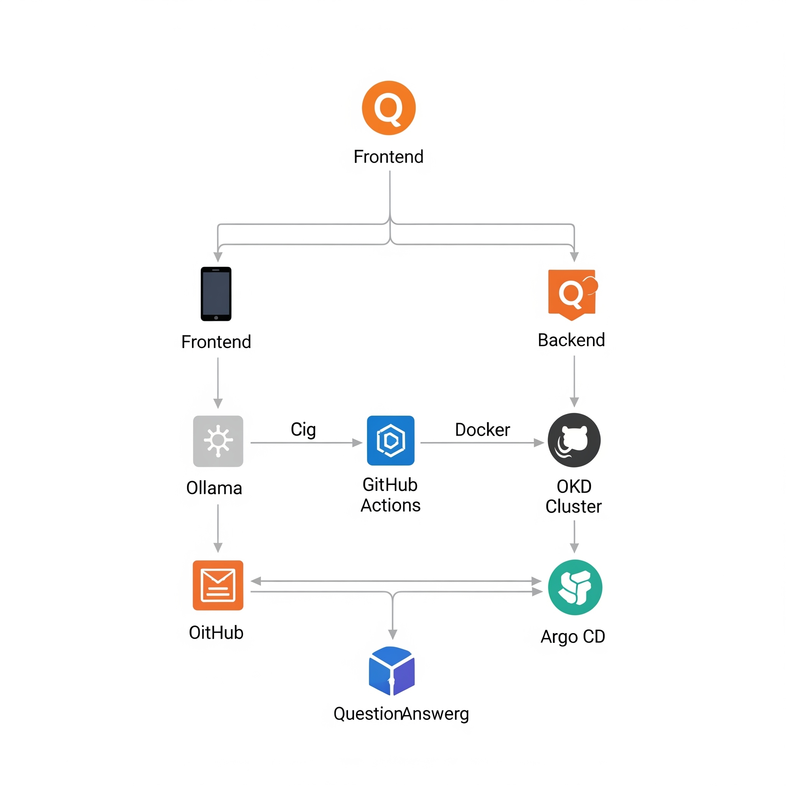

# private-llm-assistant

Front-end to local Ollama LLM

## RAG Web App with Ollama, OKD, and Argo CD

This guide provides a comprehensive walkthrough for building, containerizing, and deploying a Retrieval-augmented Generation (RAG) web application. The application uses:

- A Python backend with Flask and LangChain to connect to a local Ollama LLM.
- A simple vanilla JavaScript frontend.
- Deployment on an OKD Kubernetes cluster using a GitOps workflow with Argo CD and GitHub Actions.

---

## Table of Contents

1. [Project Architecture](#project-architecture)  
2. [Prerequisites](#prerequisites)  
3. [Step 1: Backend Service (Python + Flask)](#step-1-backend-service-python--flask)  
4. [Step 2: Frontend Application (HTML, JS, CSS)](#step-2-frontend-application-html-js-css)  
5. [Step 3: Containerizing with Docker](#step-3-containerizing-with-docker)  
6. [Step 4: Kubernetes Manifests for OKD](#step-4-kubernetes-manifests-for-okd)  
7. [Step 5: CI/CD with GitHub Actions & Argo CD](#step-5-cicd-with-github-actions--argo-cd)  
8. [Step 6: Setting up the Project on GitHub](#step-6-setting-up-the-project-on-github)  
9. [Step 7: Deployment and Operation](#step-7-deployment-and-operation)  

---

## Project Architecture


Here’s a breakdown of how the components interact:

- **Frontend**: A simple web interface where users can ask questions. It sends requests to the backend API.
- **Backend**: A Flask API that:
  - Loads your custom FAQ document.
  - Creates vector embeddings of the text.
  - Performs a similarity search to find the most relevant FAQ content.
  - Sends the user's question and the relevant content to your local Ollama LLM.
  - Streams the answer back to the frontend.
- **Ollama**: Your local LLM server. It must be running and accessible from your backend. For this guide, we assume Ollama is running outside the cluster and is network-accessible. If it's inside the cluster, you would use its internal service name.
- **Docker**: Both the frontend and backend applications are containerized for portability and consistent deployment.
- **GitHub & GitHub Actions**: The source code is stored on GitHub. A GitHub Actions workflow automates the building and pushing of Docker images to a container registry (like Docker Hub or Quay.io).
- **OKD Cluster**: Your Kubernetes platform where the application will be deployed.
- **Argo CD**: Installed on your OKD cluster, it follows the GitOps pattern. It monitors your GitHub repository for changes to the Kubernetes manifests and automatically syncs the cluster state to match the desired state defined in Git.


---

## Prerequisites

- **OKD Cluster**: An operational OKD cluster with `oc` (OpenShift CLI) configured to access it.
- **Argo CD**: Installed and configured on your OKD cluster.
- **Ollama**: Running and accessible over the network from where your application will be deployed. Ensure you have pulled a model, e.g., `ollama pull llama3`.
- **Docker Desktop**: For building container images locally.
- **Git & GitHub Account**: For version control and to host your repository.
- **Container Registry**: A place to push your Docker images (e.g., Docker Hub, Quay.io, or the internal OKD registry).

---

## Step 1: Backend Service (Python + Flask)

The backend will handle the core RAG logic.

### 1.1. Create Your FAQ Document

Create a file named `faq.md` in the `backend` directory. This is the knowledge base for your application.

### 1.2. Set up the Python Environment

Create a `backend` directory. Inside it, you'll have:

- `app.py`: The Flask application logic. It sets up a RAG pipeline using LangChain. We use FAISS for an in-memory vector store, which is simple and efficient for this use case.
- `requirements.txt`: Lists the Python dependencies.
- `faq.md`: Your FAQ document.

---

## Step 2: Frontend Application (HTML, JS, CSS)

The frontend provides the user interface. Create a `frontend` directory with the following files:

- `index.html`
- `style.css`
- `script.js`

---

## Step 3: Containerizing with Docker

We need a `Dockerfile` for both the frontend and backend to create container images.

- **Backend Dockerfile**: Uses a Python base image, installs dependencies, and runs the Flask app.
- **Frontend Dockerfile**: Uses an Nginx base image to serve the static HTML, CSS, and JS files.

---

## Step 4: Kubernetes Manifests for OKD

For a GitOps workflow, we define our application's desired state in Kubernetes YAML files. Create a `k8s` directory in your repository.

- `deployment.yaml`: Defines two deployments, one for the frontend and one for the backend. It specifies the container images, ports, and resource requests.
- `service.yaml`: Creates internal ClusterIP services to allow the frontend and backend to communicate with each other within the cluster.
- `route.yaml`: This is an OpenShift/OKD specific resource (equivalent to an Ingress) that exposes the frontend service to the outside world so users can access the web app.

---

## Step 5: CI/CD with GitHub Actions & Argo CD

This automates the deployment process.

### 5.1. GitHub Actions Workflow

Create a workflow file at `.github/workflows/ci-cd.yaml`. This workflow will:

- Trigger on pushes to the main branch.
- Log in to your container registry.
- Build and push the frontend and backend Docker images.

> **Note**: It does not directly interact with Kubernetes. The GitOps tool (Argo CD) handles the deployment part.

### 5.2. Argo CD Application

Once Argo CD is running in your cluster, you will configure it (either via the UI or a YAML manifest) to monitor the `k8s` directory in your GitHub repository.

---

## Step 6: Setting up the Project on GitHub

### Create a Repository

Create a new public or private repository on GitHub.

### File Structure

Organize your files as described:

```
.
├── .github/workflows/
│   └── ci-cd.yaml
├── backend/
│   ├── app.py
│   ├── Dockerfile
│   ├── faq.md
│   └── requirements.txt
├── frontend/
│   ├── Dockerfile
│   ├── index.html
│   ├── script.js
│   └── style.css
└── k8s/
    ├── deployment.yaml
    ├── route.yaml
    └── service.yaml
```

### Add Registry Secrets

In your GitHub repository settings (`Settings > Secrets and variables > Actions`), add the following secrets:

- `DOCKERHUB_USERNAME`: Your Docker Hub username.
- `DOCKERHUB_TOKEN`: Your Docker Hub access token.

---

## Step 7: Deployment and Operation

### Push to GitHub

Push all your code to the main branch of your new repository. This will trigger the GitHub Actions workflow to build and push your Docker images.

### Configure Argo CD

1. Access your Argo CD dashboard.
2. Create a new Application:
   - **Repository URL**: Your GitHub repository URL.
   - **Revision**: HEAD.
   - **Path**: `k8s`.
   - **Destination Cluster URL**: `https://kubernetes.default.svc`.
   - **Namespace**: The OKD project/namespace where you want to deploy (e.g., `ollama-chat`). Create it first with `oc new-project ollama-chat`.
3. Sync in Argo CD: Once the application is created, Argo CD will detect the manifests in the `k8s` directory and show that it is `OutOfSync`. Click the Sync button.

### Access Your App

Argo CD will create the deployments, services, and the route. Find the URL from the `oc get routes` command in your project's namespace and access your application in a web browser.

---

This setup provides a robust, automated way to manage your application. To update the app, you simply push changes to your Git repository, and the pipeline takes care of the rest.
